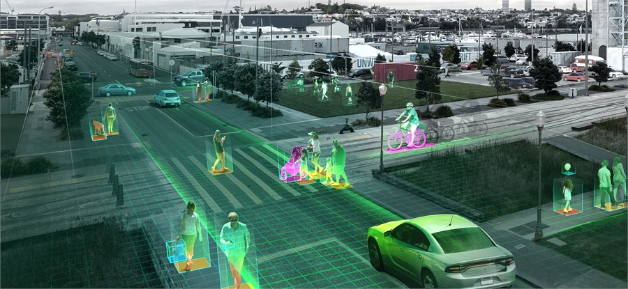

# Object-Detection-YOLOv8



## Overview

This repository contains the code for an Object Detection project. Object detection is a computer vision technique that involves locating and classifying objects in images or video. This project aims to implement object detection using [insert technique or framework here, e.g., YOLO, SSD, Faster R-CNN, etc.].

Below are the main projects and chapters covered in this repository.

## Projects:

### Project 1: Car Counter
- This project focuses on detecting and counting cars in images or video streams.
- Implementation: Using YOLOv8, the system identifies cars in a given image or video and provides a count of the total number of cars detected.

### Project 2: People Counter
- This project involves detecting and counting people in images or video streams.
- Implementation: YOLOv8 is utilized to identify individuals in images or video footage and provides a count of the total number of people detected.

### Project 3: PPE Detection
- This project aims to detect whether individuals are wearing Personal Protective Equipment (PPE) such as helmets, vests, and goggles.
- Implementation: YOLOv8 is employed to identify PPE items in images or video feeds, ensuring safety compliance.

### Project 4: Poker Hand Detector
- This project focuses on identifying and recognizing poker hands in images or video streams.
- Implementation: Utilizing YOLOv8, the system identifies and classifies various poker hands present in an image or video.

## Chapters:

### Chapter 5: Running YOLO
- This chapter provides instructions on how to run the YOLOv8 algorithm for object detection tasks.
- Implementation: Step-by-step guide on installing dependencies, configuring the environment, and executing YOLOv8 for object detection.

### Chapter 6: YOLO with Webcam
- This chapter explains how to utilize YOLOv8 with a webcam for real-time object detection.
- Implementation: Instructions on setting up the webcam, configuring YOLOv8, and running real-time object detection on live video feeds.


## Features

- [ ] Object detection model implementation
- [ ] Training pipeline
- [ ] Evaluation scripts
- [ ] Pre-trained models
- [ ] Documentation

## Requirements

- [Python](https://www.python.org/) >= 3.8
### Ensure you have the following dependencies installed:

- [cvzone](https://github.com/cvzone/cvzone) (version 1.5.6)
- [ultralytics](https://github.com/ultralytics/yolov5) (version 8.0.26)
- [hydra-core](https://github.com/facebookresearch/hydra) (version >= 1.2.0)
- [matplotlib](https://matplotlib.org/) (version >= 3.2.2)
- [numpy](https://numpy.org/) (version >= 1.18.5)
- [opencv-python](https://github.com/opencv/opencv-python) (version 4.5.4.60)
- [Pillow](https://python-pillow.org/) (version >= 7.1.2)
- [PyYAML](https://pyyaml.org/) (version >= 5.3.1)
- [requests](https://docs.python-requests.org/en/latest/) (version >= 2.23.0)
- [scipy](https://www.scipy.org/) (version >= 1.4.1)
- [torch](https://pytorch.org/) (version >= 1.7.0)
- [torchvision](https://pytorch.org/vision/) (version >= 0.8.1)
- [tqdm](https://github.com/tqdm/tqdm) (version >= 4.64.0)
- [filterpy](https://github.com/rlabbe/filterpy) (version 1.4.5)
- [scikit-image](https://scikit-image.org/) (version 0.19.3)
- [lap](https://github.com/cheind/py-lap) (version 0.4.0)

You can install these dependencies using pip:

```bash
pip install -r requirements.txt
```
## Installation

1. Clone the repository:

```bash
git clone https://github.com/Abdallah-707/Object-Detection.git
```

## License:
This project is licensed under the MIT License - see the [LICENSE](LICENSE) file for details.
